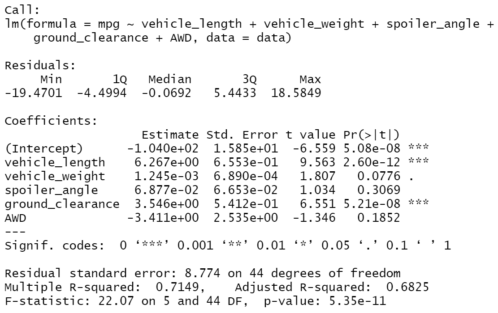
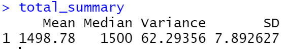
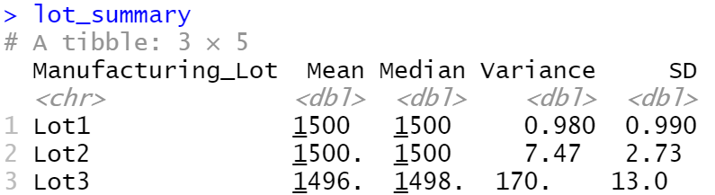

# MechaCar_Statistical_Analysis

## Linear Regression to Predict MPG

vehicle_length and ground_clearance are statistically unlikely to provide random amounts of variance to the linear model.

The slope of the other three variables: vehicle_weight, spoiler_angle, and AWD are considered to be zero.

This linear model predict mpg of MechaCar effectively, because the p-value of the F-statistic is very small 5.35e-11.

## Summary Statistics on Suspension Coils
### Total Summary

### Lot Summary

Based on the variance stats, the manufacturing lots in total meet the design specification because the total variance is smaller than 100. However, when you look closely to every lot, the ones in Lot3 don't meet the design specification.

