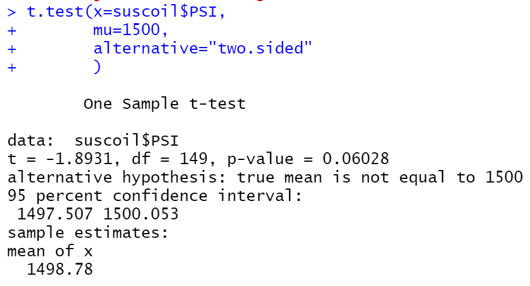
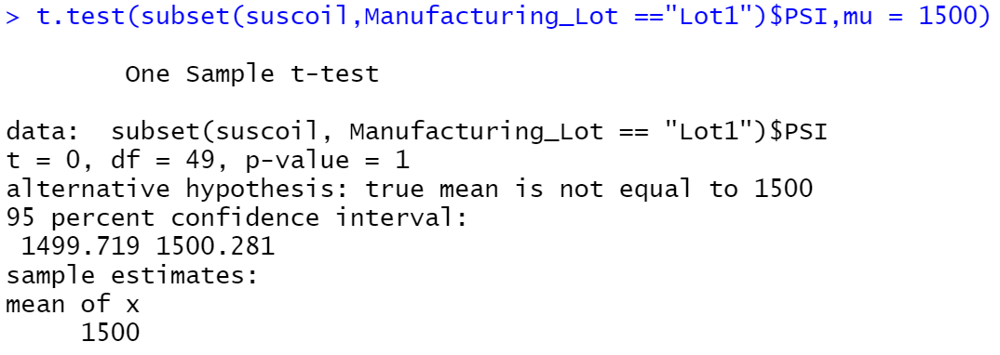
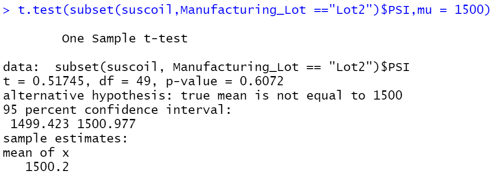
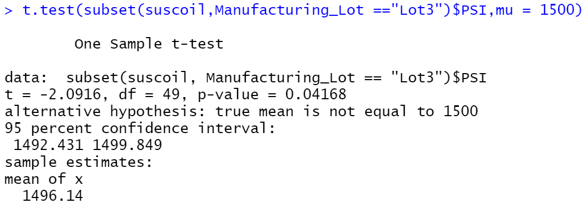

# MechaCar_Statistical_Analysis

## Linear Regression to Predict MPG

vehicle_length and ground_clearance are statistically unlikely to provide random amounts of variance to the linear model.

The slope of the other three variables: vehicle_weight, spoiler_angle, and AWD are considered to be zero.

This linear model predict mpg of MechaCar effectively, because the p-value of the F-statistic is very small 5.35e-11.

## Summary Statistics on Suspension Coils
### Total Summary

### Lot Summary

Based on the variance stats, the manufacturing lots in total meet the design specification because the total variance is smaller than 100. However, when you look closely to every lot, the ones in Lot3 don't meet the design specification.

## T-Tests on Suspension Coils

The p-value is 0.06028, which means the PSI across all manufacturing lots is not statistically different from the population mean of 1,500 pounds per square inch at 95% confience level.

Only the p-value of Lot 3 is smaller than 0.05, which means the PSI of Lot 3 is statistically different from 1500.

## Study Design: MechaCar vs Competition
Let's use the cost as the metric. We will compare MechaCar and Porsche.

The Null hypothesis will be the cost of MechaCar is the same as the cost of Porsche.
The Alternative hypothesis then will be the cost of two brands are different.

The statistical test will be the two-sample t-test, because obviously we want to determine whether the means of two samples are statistically different.

The data will be a sample of the costs of MechaCar cars and another sample of the costs of Porsche cars.